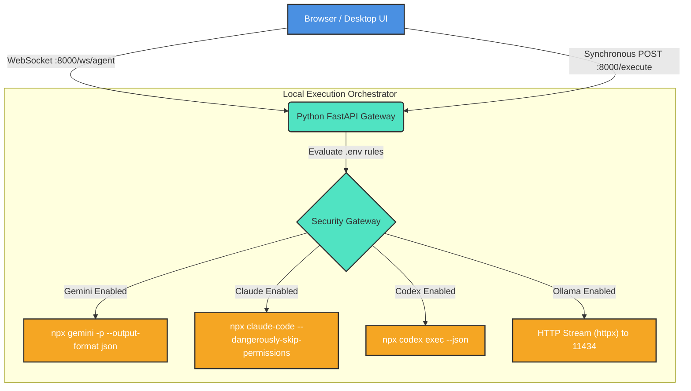
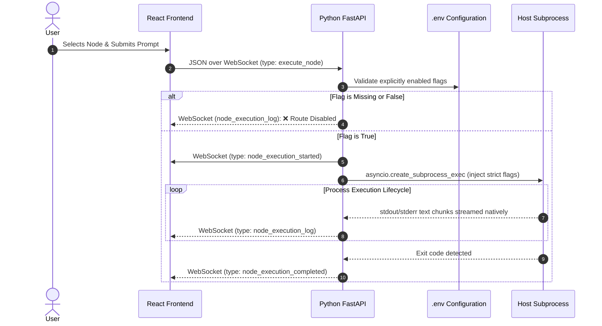
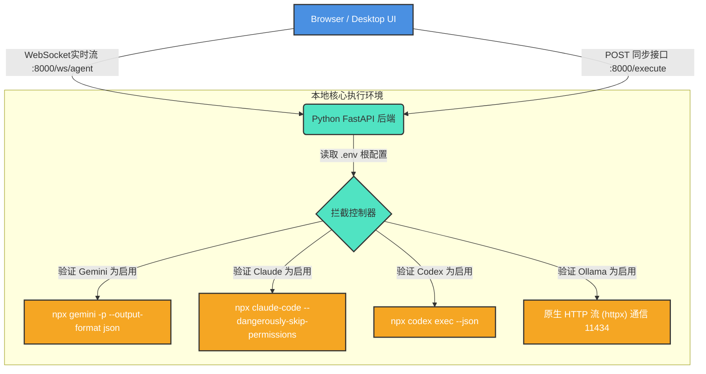
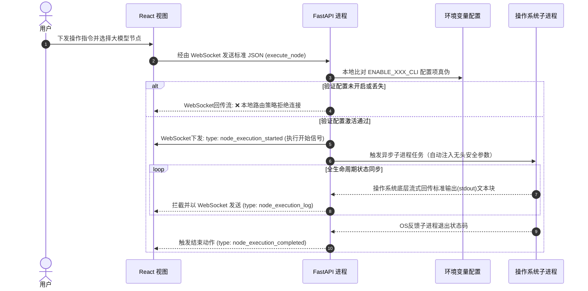

# AI Agents Route Service (AI 终端控制网关)

[English](#english) | [简体中文](#简体中文)

---

<a id="english"></a>
## 🇬🇧 English Documentation

A powerful, configuration-driven routing service built to unify and orchestrate multiple foundational AI Agent CLIs. This application serves as a localized multiplexer leveraging a **Python FastAPI** backend to seamlessly structure and stream execution logs from headless Operating System binaries (like Google Gemini CLI, Anthropic Claude Code, and OpenAI Codex) directly into a modernized **React Frontend Dashboard** via WebSockets.

### 🏗 Architecture Overview



#### Message Sequence Flowchart


1. `packages/frontend`: The React UI. It streams user queries securely via WebSockets directly to the local Python gateway.
2. `packages/api_bridge`: A high-performance Python `FastAPI` instance serving on `http://localhost:8000`. It translates native JSON network payloads down to local OS pathways autonomously.

### 🚀 Step-by-Step Quickstart

#### 1. System Requirements & Python Installation
- [Node.js](https://nodejs.org/en) (v20+) for building the React SPA
- **Python 3.10+** for the localized FastAPI core. If you do not have Python installed, please follow your system instructions below:

  **macOS (via Homebrew):**
  ```bash
  brew install python@3.11
  ```
  **Ubuntu / Debian:**
  ```bash
  sudo apt update && sudo apt install python3 python3-venv python3-pip
  ```
  **Windows:** Download the official installer from [Python.org](https://www.python.org/downloads/windows/) (ensure "Add python.exe to PATH" is checked during installation!).

- *Your target AI CLI tools installed globally (e.g., `npm i -g @anthropic-ai/claude-code`, etc)*

#### 2. Prepare the Environment
Clone the repository and install the standard workspace dependencies:
```bash
npm install
```

Copy the global configuration template into the root folder:
```bash
cp .env.example .env
```

#### 3. Manage Your AI Engines (.env)
Edit `.env` to precisely enable or disable agents. The local Python Daemon will block traffic to any agent set to `false`.
```env
ENABLE_CLAUDE_REMOTE_CONTROL=true
ENABLE_GEMINI_CLI=true
ENABLE_CODEX_SERVER=false
ENABLE_OLLAMA_API=true
OLLAMA_BASE_URL=http://localhost:11434
```

#### 4. Claude Pre-Authentication
If you intend to use Claude, you **must** authenticate it interactively on your machine first natively through your web browser. This generates the core session tokens so the Python Backend can securely bypass the interactive prompts in headless mode!
```bash
npx @anthropic-ai/claude-code auth login
```

#### 5. Starting the Application
```bash
./start.sh
```
*This smart script will automatically initialize the Python virtual environment (`venv`), install Python dependencies, start the FastAPI server on port 8000, and launch the React UI on port 5173 natively in the background.*

All system logs are completely safely configured to write to:
- `bridge.log`
- `frontend.log`

Navigate to `http://localhost:5173` to use the Dashboard! When finished, terminate all processes natively:
```bash
./stop.sh
```

#### 6. Notes on Remote Node Execution (MFLUX / Ollama)
If you are pointing the system to a remote node API (e.g. `http://192.168.0.2:8000`) for generative tasks:
- **Zero-Timeout:** The Python gateway explicitly disables timeouts for graphic generation.
- **Cold Booting:** The very first request you send to MFLUX may take up to several minutes! This occurs because the remote API node must download gigabytes of model weights into its Hugging Face cache.
- **Firewall:** Ensure you have allowed inbound Python traffic on your MacOS/Linux firewall (System Settings → Network → Firewall) for your chosen remote ports.

#### 7. Example Output (MFLUX Qwen-Image)
Here is an example of the Agent Route Service orchestrating a visual render over the LAN to the `mlx-community/Qwen-Image-2512-8bit` LLM node:

**Prompt:** `A futuristic cybernetic tiger roaming a neon city`

**Result:**


### 💻 External API Access
Because the underlying architecture leverages **FastAPI**, you can bypass the React UI entirely and call the agents synchronously from any desktop app or script:

**`POST http://127.0.0.1:8000/execute`**
```json
{
  "client": "gemini",
  "prompt": "Evaluate system stability."
}
```

---

<a id="简体中文"></a>
## 🇨🇳 简体中文文档

一个强大且基于配置驱动的路由网关，旨在统一管理与调用各类底层 AI Agent CLI（命令行工具）。本项目作为一个本地化的调度中心，通过 **Python FastAPI** 后端将底层无头命令行程序（如 Google Gemini CLI, Anthropic Claude Code, OpenAI Codex）的标准输出结构化，并通过 WebSocket 协议实时呈现在包含现代化交互的 **React 前端面板** 中。

### 🏗 架构系统流转图



#### 实时通信握手协议


1. `packages/frontend`: React 前端交互面板，通过 WebSocket 将用户的任务指令直接流式传输到本地 Python 网关。
2. `packages/api_bridge`: 运行在 `http://localhost:8000` 端口的高性能 Python `FastAPI` 后端。它负责将网络 JSON 载荷解析，并安全地生成对应的操作系统原生常驻子进程。

### 🚀 安装与运行步骤

#### 1. 系统要求与 Python 安装指南
- [Node.js](https://nodejs.org/en) (v20+)：用于构建 React 前端应用。
- **Python 3.10+**：用于部署本地的 FastAPI 核心桥接器。如果你还未安装 Python，请根据你的系统执行以下安装步骤：

  **macOS (推荐通过 Homebrew):**
  ```bash
  brew install python@3.11
  ```
  **Ubuntu / Debian (Linux):**
  ```bash
  sudo apt update && sudo apt install python3 python3-venv python3-pip
  ```
  **Windows:** 请前往 [Python.org](https://www.python.org/downloads/windows/) 下载官方安装包（**安装时务必勾选 "Add python.exe to PATH"**！）。

- *全局安装你想要使用的 AI 命令行工具 (例如：`npm i -g @anthropic-ai/claude-code` 等)*

#### 2. 环境初始化
克隆本项目，随后在根目录下安装工程核心依赖：
```bash
npm install
```

从示例中生成你的专属环境变量：
```bash
cp .env.example .env
```

#### 3. 灵活管理 AI 引擎开启状态 (.env)
打开 `.env` 文件，精确控制 AI 工具的运行权限。任何被设置为 `false` 的服务，本地 Python 防火墙将主动拒绝并拦截前往该工具的网络请求。
```env
ENABLE_CLAUDE_REMOTE_CONTROL=true
ENABLE_GEMINI_CLI=true
ENABLE_CODEX_SERVER=false
ENABLE_OLLAMA_API=true
OLLAMA_BASE_URL=http://localhost:11434
```

#### 4. Claude 账号预授权
由于框架基于底层的 `--dangerously-skip-permissions` 全自动权限跳过机制运行，在首次运行前，你 **必须** 至少进行一次手动终端身份验证，在浏览器内授权你的账号。
```bash
npx @anthropic-ai/claude-code auth login
```

#### 5. 一键启动服务
```bash
./start.sh
```
*这个执行脚本将自动创建 Python 的虚拟容器 (`venv`)，拉取依赖体系，在 8000 端口后台启动 FastAPI 网关，并在 5173 端口后台部署可视化的 React 界面。*

所有的系统运行日志将默认保存在根目录，供你随时调试：
- `bridge.log` （包含模型调用的所有 Python 执行记录）
- `frontend.log`

请在浏览器打开 `http://localhost:5173` 使用终端全功能！当你想关闭全部关联进程时，仅需执行：
```bash
./stop.sh
```

#### 6. 关于远程节点执行的特别说明 (MFLUX / Ollama)
如果您正在将系统指向局域网的远程 API 节点 (例如 `http://192.168.0.2:8000`) 执行生成任务：
- **无超时设定:** Python 网关已明确移除了对长时间图像生成任务的超时限制。
- **首次冷启动缓存:** 您向 MFLUX 发送的**第一条**图像请求可能会耗费数分钟的时间！因为这取决于远程节点通过 Hugging Face 完整下载并加载数百MB甚至数GB模型权重的速度。
- **防火墙设定:** 请确保您已在承载远程节点的电脑管家或 macOS 防火墙（系统设置 → 网络）中对相关端口放行了入站流量。

#### 7. 渲染示例 (MFLUX Qwen-Image)
以下是 Agent Route Service 通过局域网跨系统调用 `mlx-community/Qwen-Image-2512-8bit` 节点并实时传回前端的渲染结果展示：

**Prompt 提示词:** `A futuristic cybernetic tiger roaming a neon city`

**Result 渲染结果:**


### 💻 外部开发者 API 介入
由于底层使用 **FastAPI** 直接重构，你不受任何 React 用户界面的限制！你可以从桌面自动化工具、脚本语言中直接向底层桥接器发起同步调用请求：

**`POST http://127.0.0.1:8000/execute`**
```json
{
  "client": "gemini",
  "prompt": "Evaluate system stability."
}
```
