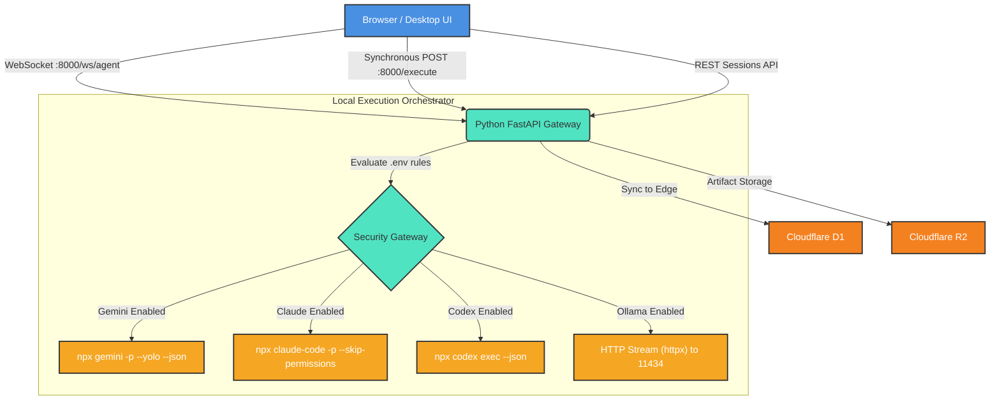
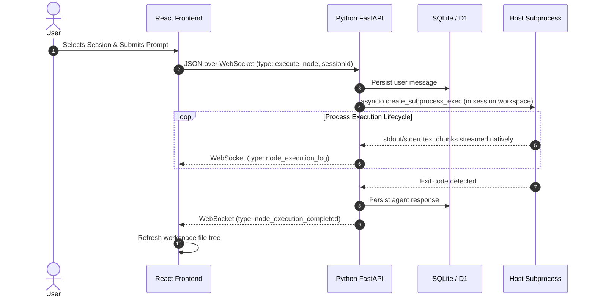
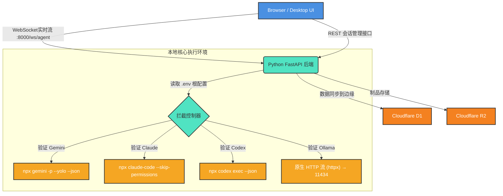

# AI Agents Route Service (AI 终端控制网关)

[English](#english) | [简体中文](#简体中文)

---

<a id="english"></a>
## 🇬🇧 English Documentation

A powerful, configuration-driven routing service built to unify and orchestrate multiple foundational AI Agent CLIs. This application serves as a localized multiplexer leveraging a **Python FastAPI** backend to seamlessly structure and stream execution logs from headless Operating System binaries (like Google Gemini CLI, Anthropic Claude Code, and OpenAI Codex) directly into a modernized **React Frontend Dashboard** via WebSockets.

### 🏗 Architecture Overview



#### Message Sequence Flowchart


### 📦 Project Structure

```
agent-route/
├── init.sh               # First-time environment setup
├── start.sh              # Launch all services
├── stop.sh               # Terminate all services
├── .env.example          # Configuration template
├── packages/
│   ├── frontend/         # React + Vite dashboard
│   ├── api_bridge/       # Python FastAPI local gateway
│   │   └── app/
│   │       ├── main.py        # REST + WebSocket endpoints
│   │       ├── executor.py    # CLI subprocess orchestrator
│   │       ├── session_store.py  # SQLite session/project CRUD
│   │       └── history.py     # Legacy execution logs
│   ├── backend/          # Cloudflare Workers (Hono + D1)
│   │   ├── schema.sql    # Unified D1 database schema
│   │   ├── wrangler.toml # Cloudflare bindings
│   │   └── src/index.ts  # Edge API (mirrors local API)
│   └── workspaces/       # Per-session isolated directories
│       └── sessions/     # {session_id}/ (auto-created)
```

### 🧩 Core Features

| Feature | Description |
|---------|-------------|
| **Multi-Agent Routing** | Route prompts to Gemini, Claude, Codex, Ollama, or MFLUX from a single interface |
| **Session Management** | Persistent sessions with SQLite/D1 — survive restarts, organize by projects |
| **Workspace Isolation** | Each session gets its own working directory — no cross-session file conflicts |
| **Real-time Streaming** | WebSocket-based log streaming with live output parsing |
| **Workspace File Browser** | Right sidebar showing session workspace files with inline previewer |
| **Edge Persistence** | Cloudflare D1/R2 for cloud-native storage (optional, via `packages/backend`) |

### 🚀 Quick Start

#### 1. First-Time Setup
```bash
git clone <repo-url>
cd agent-route
./init.sh
```

The `init.sh` script automatically:
- Installs Node.js workspace dependencies
- Creates `.env` from `.env.example`
- Creates Python virtual environment + installs packages
- Initializes the D1 local database schema
- Creates workspace directories
- Detects available AI CLI tools

#### 2. Configure AI Engines (`.env`)
```env
ENABLE_GEMINI_CLI=true
ENABLE_CLAUDE_REMOTE_CONTROL=true
ENABLE_CODEX_SERVER=true
ENABLE_OLLAMA_API=true
OLLAMA_BASE_URL=http://localhost:11434
ENABLE_MFLUX_IMAGE=true

# Session workspace isolation
SESSION_WORKSPACE_BASE=./packages/workspaces/sessions
```

#### 3. Pre-Authenticate CLI Tools
```bash
# Claude (required for headless mode)
npx @anthropic-ai/claude-code auth login

# Gemini (if using Google AI)
npx gemini auth login
```

#### 4. Start the Service
```bash
./start.sh
```
Navigate to **http://localhost:5173** to use the Dashboard.

To stop:
```bash
./stop.sh
```

#### 5. Manual Start (Development)
```bash
# Terminal 1: Python Backend
cd packages/api_bridge && venv/bin/uvicorn app.main:app --port 8000 --reload

# Terminal 2: React Frontend
npm run dev:frontend
```

### 🗄 Storage Architecture

The service uses a **dual-storage** strategy:

| Layer | Technology | Purpose |
|-------|-----------|---------|
| **Local** | SQLite (`sessions.db`) | Session/project CRUD, message history, workspace paths |
| **Edge** | Cloudflare D1 | Cloud persistence (same schema, via `packages/backend`) |
| **Artifacts** | Cloudflare R2 | Binary assets, generated images |
| **Workspaces** | Filesystem | Per-session isolated directories for agent execution |

#### Unified D1 Schema
Both the local SQLite (managed by `session_store.py`) and the Cloudflare D1 (managed by `wrangler`) share the same table structure defined in [`packages/backend/schema.sql`](packages/backend/schema.sql):

```sql
projects     → Logical grouping (id, name, color, timestamps)
sessions     → Conversation threads (id, project_id, title, agent_type, workspace_dir)
messages     → Chat history (session_id, source, content, image_b64, agent_type)
historical_logs → Legacy execution records
```

#### Cloudflare D1 Setup (Optional)
```bash
cd packages/backend
npx wrangler login

# Provision infrastructure
npx wrangler d1 create cli_db
npx wrangler r2 bucket create cli-route-artifacts

# Update wrangler.toml with the database_id from above, then:
npx wrangler d1 execute cli_db --local --file=./schema.sql

# Deploy to edge
npm run dev
```

### 💻 API Reference

#### Session Management REST
| Method | Endpoint | Description |
|--------|----------|-------------|
| `GET` | `/api/projects` | List all projects |
| `POST` | `/api/projects` | Create a project |
| `PUT` | `/api/projects/:id` | Update a project |
| `DELETE` | `/api/projects/:id` | Delete a project |
| `GET` | `/api/sessions` | List all sessions |
| `POST` | `/api/sessions` | Create a session (auto-provisions workspace) |
| `PUT` | `/api/sessions/:id` | Update session metadata |
| `DELETE` | `/api/sessions/:id` | Delete session + cleanup workspace |
| `GET` | `/api/sessions/:id/messages` | Get conversation history |
| `GET` | `/api/sessions/:id/workspace` | List workspace files |
| `GET` | `/api/sessions/:id/workspace/read?path=` | Read file contents |

#### Synchronous REST Execution
**`POST http://127.0.0.1:8000/execute`**
```json
{
  "client": "gemini",
  "prompt": "Evaluate system stability."
}
```
Response:
```json
{
  "output": "System is operating normally at 99%.",
  "exitCode": 0
}
```

#### Streaming REST Execution (ndjson)
**`POST http://127.0.0.1:8000/execute/stream`**
```bash
curl -N -X POST http://127.0.0.1:8000/execute/stream \
     -H "Content-Type: application/json" \
     -d '{"client":"gemini","prompt":"Why is water wet?"}'
```

#### WebSocket Streaming
**`ws://127.0.0.1:8000/ws/agent`**
```json
// Client sends:
{ "type": "execute_node", "client": "gemini", "prompt": "...", "sessionId": "abc123" }

// Server streams back:
{ "type": "node_execution_started", "nodeId": "..." }
{ "type": "node_execution_log", "nodeId": "...", "log": "[System] Running..." }
{ "type": "node_execution_completed", "nodeId": "...", "exitCode": 0 }
```

#### Dynamic Model Discovery
**`GET http://127.0.0.1:8000/models/ollama`**
```json
{ "models": ["llama3", "mistral"] }
```

### 🔧 Advanced Configuration

#### Ollama Remote Node
```bash
# On the remote machine, allow LAN access:
# macOS:  launchctl setenv OLLAMA_HOST "0.0.0.0"
# Linux:  Environment="OLLAMA_HOST=0.0.0.0" in systemd service
```

#### MFLUX Image Generation
- **Zero-Timeout:** The gateway explicitly disables timeouts for image generation.
- **Cold Boot:** First requests may take minutes while model weights download.
- **Firewall:** Ensure inbound traffic is allowed on your remote port.

**Example output (MFLUX Qwen-Image):**

**Prompt:** `A futuristic cybernetic tiger roaming a neon city`


---

<a id="简体中文"></a>
## 🇨🇳 简体中文文档

一个强大且基于配置驱动的路由网关，旨在统一管理与调用各类底层 AI Agent CLI（命令行工具）。本项目作为一个本地化的调度中心，通过 **Python FastAPI** 后端将底层无头命令行程序（如 Google Gemini CLI, Anthropic Claude Code, OpenAI Codex）的标准输出结构化，并通过 WebSocket 协议实时呈现在包含现代化交互的 **React 前端面板** 中。

### 🏗 架构系统流转图



### 🧩 核心功能

| 功能 | 说明 |
|------|------|
| **多模型路由** | 通过统一界面将任务分发给 Gemini、Claude、Codex、Ollama 或 MFLUX |
| **会话管理** | 基于 SQLite/D1 的持久化会话系统 — 重启不丢失，按项目分组 |
| **工作区隔离** | 每个会话拥有独立的工作目录 — 非不同会话之间文件不冲突 |
| **实时流式输出** | 基于 WebSocket 的实时日志流和输出解析器 |
| **工作区浏览器** | 右侧面板可查看会话工作区文件，支持内联预览 |
| **边缘持久化** | Cloudflare D1/R2 可选云端存储（通过 `packages/backend`） |

### 🚀 快速开始

#### 1. 首次安装
```bash
git clone <repo-url>
cd agent-route
./init.sh
```

`init.sh` 脚本将自动完成：
- 安装 Node.js 工作区依赖
- 从 `.env.example` 创建 `.env` 配置文件
- 创建 Python 虚拟环境并安装依赖包
- 初始化 D1 本地数据库架构
- 创建工作区目录
- 检测可用的 AI CLI 工具

#### 2. 配置 AI 引擎 (`.env`)
```env
ENABLE_GEMINI_CLI=true
ENABLE_CLAUDE_REMOTE_CONTROL=true
ENABLE_CODEX_SERVER=true
ENABLE_OLLAMA_API=true
ENABLE_MFLUX_IMAGE=true

# 每会话隔离工作区根路径
SESSION_WORKSPACE_BASE=./packages/workspaces/sessions
```

#### 3. CLI 工具预授权
```bash
npx @anthropic-ai/claude-code auth login
npx gemini auth login
```

#### 4. 一键启动
```bash
./start.sh
```
打开浏览器访问 **http://localhost:5173**

关闭服务：
```bash
./stop.sh
```

### 🗄 存储架构

| 层 | 技术 | 用途 |
|----|------|------|
| **本地** | SQLite (`sessions.db`) | 会话/项目 CRUD、消息历史、工作区路径 |
| **边缘** | Cloudflare D1 | 云端持久化（相同架构，通过 `packages/backend`） |
| **制品** | Cloudflare R2 | 二进制素材、生成的图片 |
| **工作区** | 文件系统 | 每会话隔离目录，供 Agent 执行使用 |

#### 统一数据库架构
本地 SQLite 和 Cloudflare D1 共享同一套表结构，定义在 [`packages/backend/schema.sql`](packages/backend/schema.sql) 中：
```sql
projects     → 项目分组 (id, name, color, timestamps)
sessions     → 会话线程 (id, project_id, title, agent_type, workspace_dir)
messages     → 聊天记录 (session_id, source, content, image_b64, agent_type)
historical_logs → 历史执行记录
```

#### Cloudflare D1 初始化（可选）
```bash
cd packages/backend
npx wrangler login
npx wrangler d1 create cli_db
npx wrangler r2 bucket create cli-route-artifacts
# 将生成的 database_id 更新到 wrangler.toml，然后：
npx wrangler d1 execute cli_db --local --file=./schema.sql
```

### 💻 API 参考

| 方法 | 端点 | 说明 |
|------|------|------|
| `GET` | `/api/projects` | 获取所有项目 |
| `POST` | `/api/projects` | 创建项目 |
| `GET` | `/api/sessions` | 获取所有会话 |
| `POST` | `/api/sessions` | 创建会话（自动创建隔离工作区） |
| `DELETE` | `/api/sessions/:id` | 删除会话并清理工作区 |
| `GET` | `/api/sessions/:id/messages` | 获取会话聊天记录 |
| `GET` | `/api/sessions/:id/workspace` | 列出工作区文件 |
| `GET` | `/api/sessions/:id/workspace/read?path=` | 读取文件内容 |
| `POST` | `/execute` | 同步执行 CLI 任务 |
| `POST` | `/execute/stream` | 流式执行 CLI 任务 (ndjson) |
| `ws` | `/ws/agent` | WebSocket 实时日志流 |
